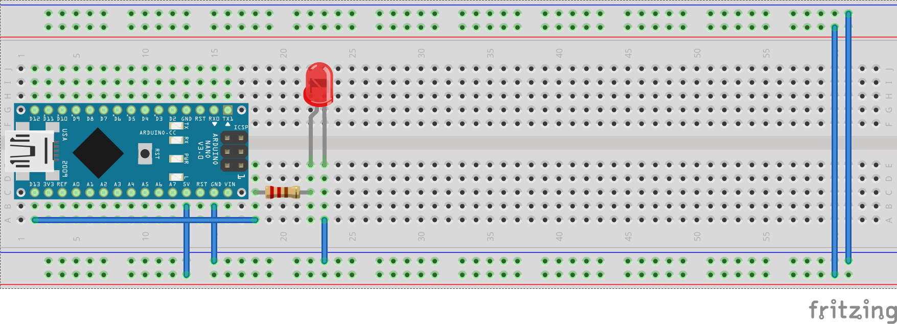
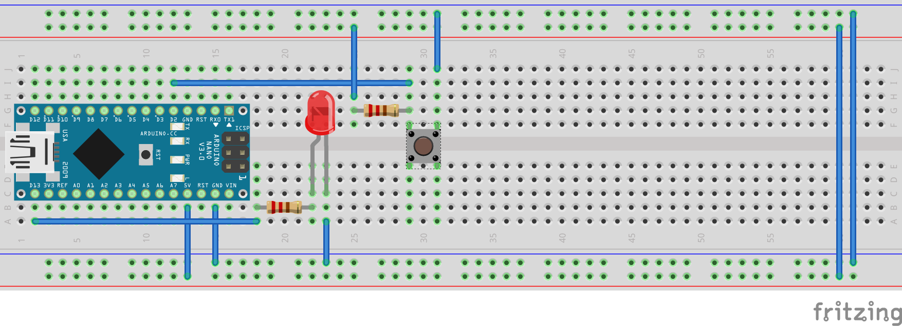
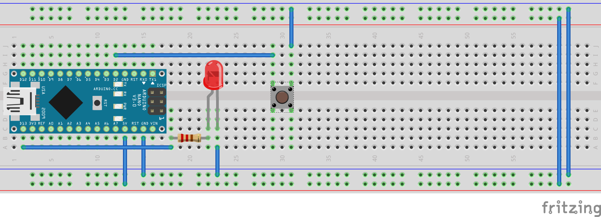
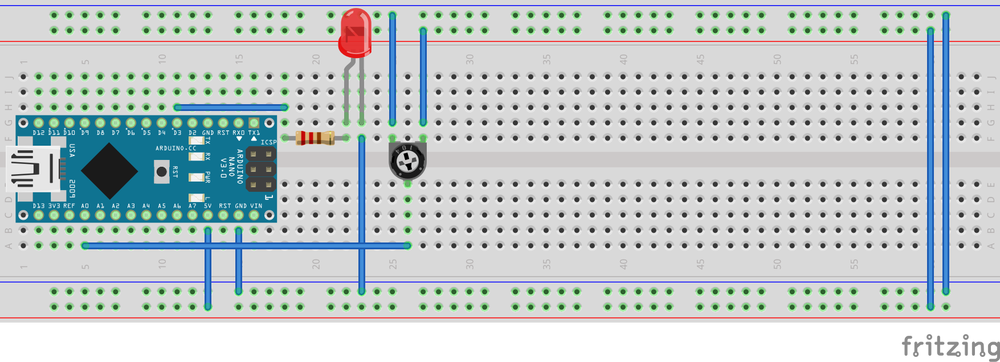
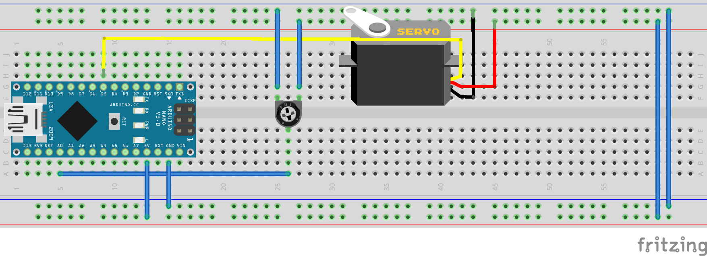
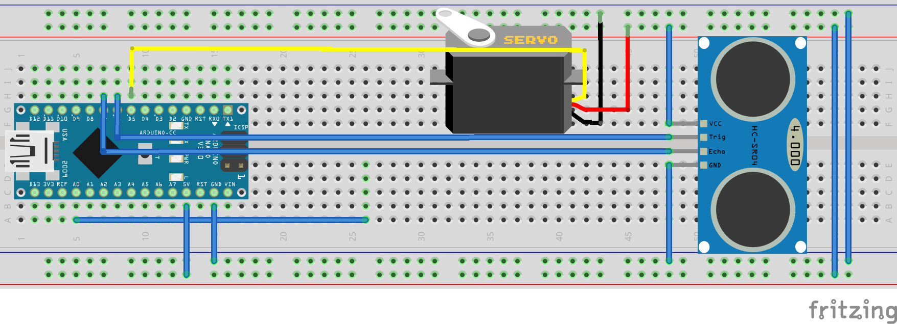

# Formation Arduino

## Spécificités de programmation
### Structure du code
Un programme Arduino utilise le langage C/C++.
```c++
// Programme Arduino
void setup {
	// setup() est exécuté une fois au démarrage de l'Arduino.
}

void loop {
	// loop() est exécuté à l'infini après setup()
}

// Équivalent C/C++ standard
void main() {
	setup();
	while(true) {
		loop();
	}
}
```

### Type des variables
On n'utilise pas ici `int`, `long`, `short`, `unsigned` car les tailles en mémoire varie selon les systèmes choisis.

On utilise `intX_t`, `uintX_t` (e.g. `int8_t` pour un entier signé sur 8 bits, `uint32_t` pour un entier non signé sur 32 bits).

### Les différents pins
Dans le programme les pins D2, …, D13 sont appelées 2, …, 13 et A0, …, A7 ont utilise A0, …, A7.

### Le bouton reset
Au milieu de l'Arduino, le bouton reset permet de redémarrer le programme (i.e. arrête ce qu'elle fait et exécute `setup()` puis `loop()` en boucle).

### Fonctions diverses
Les fonctions suivantes seront utilisé plus tard

Pour utilisé de l'aléatoire
- [`randomSeed(seed)`](https://www.arduino.cc/reference/en/language/functions/random-numbers/randomseed/) pour initialiser le générateur
- [`random(min, max)`](https://www.arduino.cc/reference/en/language/functions/random-numbers/random/) pour générer un nombre aléatoire

Pour borner une valeur dans un intervalle:
[`constrain(x, a, b)`](https://www.arduino.cc/reference/en/language/functions/math/constrain/)

Pour appliquer une fonction affine sur une valeur sans se tirer les cheveux:
[`map(value, fromLow, fromHigh, toLow, toHigh)`](https://www.arduino.cc/reference/en/language/functions/math/map/)

### Utilisation de Platformio
Nous utilisons Platformio dans Atom pour programmer l'Arduino.

Il faut toujours ajouter en entête du fichier qui contient la fonction `main()`
```c++
#include <Arduino.h> // Importe la bibliothèque Arduino
```

Voici quelque racourci utile

| Action                        | Raccourci     |
| ----------------------------- | ------------- |
| Pour compiler                 | `Ctrl+Alt+B`  |
| Pour téléverser               | `Ctr+Alt+U`   |
| Pour ouvrir un terminal       | `Alt+Shift+T` |
| Pour ouvrir le moniteur série | `Alt+Shift+M` |

## Entrées/Sorties numériques (Digital Input/Output)

Les signaux numériques sont des 0 et 1 représentés par GND (0V) et VCC (5V) pour Arduino Uno et Nano.

Les entrées numériques mesurent l'état de la pin.
Les sorties numériques contrôlent l'état de la pin.

On peut choisir le mode entrée ou sortie de la pin avec la fonctions [`pinMode(pin, mode)`](https://www.arduino.cc/reference/en/language/functions/digital-io/pinmode/).
Les deux modes sont :
- `OUTPUT`
- `INPUT`

L'état d'une pin peut être :
- `HIGH`
- `LOW`

On règle l'état d'une pin dans le mode `OUTPUT` avec
[`digitalWrite(pin, value)`](https://www.arduino.cc/reference/en/language/functions/digital-io/digitalwrite/).

On lit l'état d'une pin qui est dans le mode `INPUT` avec
[`digitalRead(pin)`](https://www.arduino.cc/reference/en/language/functions/digital-io/digitalread/) qui retourne l'état commme précédemment.

### Allumer une led


- Attention à brancher la led dans le bon sens.
- Il faut toujours utiliser une résistance pour protéger la led.

```c++
// Déclare la pin pour
const uint8_t LED = 13; // la led

void setup() {
	pinMode(LED, OUTPUT); // Led en mode sortie
	digitalWrite(LED, HIGH); // Allume la led.
}

void loop() {

}
```

### Contrôler une led avec un bouton


- Le bouton est à l'état au haut au repos et l'état bas quand il est appuyé.
- Le bouton est relié à la masse d'un côté et à l'entrée numérique de l'autre.
- Une pull-up est ajouté pour fixer l'état haut ([Pull-up - Wikipédia](https://fr.wikipedia.org/wiki/R%C3%A9sistance_de_rappel))

```c++
// Déclare les pins pour
const uint8_t LED = 13; // la led
const uint8_t BUTTON = 2; // le bouton

uint8_t button_state; // État du bouton

void setup() {
	pinMode(LED, OUTPUT); // Led en mode sortie
	pinMode(BUTTON, INPUT); // Bouton en mode entrée
}

void loop() {
	button_state = digitalRead(BUTTON); // Lit la l'état du bouton
	digitalWrite(LED, button_state); // La led prend l'état du bouton
}
```


- L'Arduino dispose d'une résistance de pull-up interne.
- On peut ainsi enlever la pull-up externe et modifier le programme pour l'utiliser.

```c++
// Déclare les pins pour
const uint8_t LED = 13; // la led
const uint8_t BUTTON = 2; // le bouton

uint8_t button_state; // État du bouton

void setup() {
	pinMode(LED, OUTPUT); // Led en mode sortie
	pinMode(BUTTON, INPUT_PULLUP); // Bouton en mode entrée pull-up
}

void loop() {
	button_state = digitalRead(BUTTON); // Lit la l'état du bouton
	digitalWrite(LED, button_state); // La led prend l'état du bouton
}
```

### Challenge
- Inverse l'allumage de la led selon la position du bouton par rapport au programme précédent.

## Gestion du temps
Sur Arduino, deux méthodes principales existent pour interagir avec le temps.

[`delay(ms)`](https://www.arduino.cc/reference/en/language/functions/time/delay/) arrête le programme pendant un certain temps donné en millisecondes. On appel ce mode de fonctionnement bloquant car on ne peut faire autre chose à côté.

On peut ainsi faire clignoter une led.

```c++
// Déclare la pin pour
const uint8_t LED = 13; // la led

const uint32_t time = 500; // Temps d'attente

void setup() {
	pinMode(LED, OUTPUT); // Led en mode sortie
}

void loop() {
	digitalWrite(LED, HIGH); // Allume la led
	delay(time); // Attend time millisecondes
	digitalWrite(LED, LOW); // Éteind la led
	delay(time); // Attend time millisecondes
}
```

[`millis()`](https://www.arduino.cc/reference/en/language/functions/time/millis/) renvoie le temps écoulé le démarrage de l'arduino en millisecondes.

```c++
// Déclare la pin pour
const uint8_t LED = 13; // la led

const uint32_t time = 500; // Temps d'attente

void setup() {
	pinMode(LED, OUTPUT); // Led en mode sortie
}

void loop() {
	if (millis() % (time*2) < time) // Test quelle action faire
		digitalWrite(LED, HIGH); // Alume la led
	else
		digitalWrite(LED, LOW); // Éteind la led
}
```

Les équivalents de `delay(ms)` et `millis()` pour manipuler le temps en microsecondes sont respectivement [`delayMicroseconds(us)`](https://www.arduino.cc/reference/en/language/functions/time/delaymicroseconds/) et [`micros()`](https://www.arduino.cc/reference/en/language/functions/time/micros/)

### Challenges
1. Fait clignoter une led irrégulièrement.
2. Fait clignoter deux leds à différentes fréquences.
3. Allume la led pendant un certain temps après avoir appuyer sur le bouton.
4. Change l'état de la led à chaque appuie du bouton.

## Analogique
Pour lire la tension d'une pin, on utilise [`analogRead(pin)`](https://www.arduino.cc/reference/en/language/functions/analog-io/analogread/). Cette fonction renvoie une valeur entre 0 et 1023 (CAN 10 bits). On peut utiliser les pins `A0`, …, `A7` mesurer une tension.

L'Arduino ne peut pas générer de tension entre 0V et 5V. Mais, [`analogWrite(pin, value)`](https://www.arduino.cc/reference/en/language/functions/analog-io/analogwrite/) peut générer un signal rectangulaire avec un rapport cyclique variable qui a en moyenne la tension voulu. La tension générer est proportionelle à la valeur passé en argument entre 0 et 255. On peut utiliser les pins `3`, `5`, `6`, `9`, `10`, `11` pour générer un signal PWM.


- On utilise la position du potentiomètre pour changer l'intensité de la led.
- `pinMode(pin, mode)` est uniquement pour les entrées/sorties numérique. C'est inutile pour celles analogiques.

```c++
// Déclare les pins pour
const uint8_t LED_PWM = 3; // la led contrôlée en PWM
const uint8_t POT = A0; // le potentiomètre

uint16_t pot_position; // Position du potentiomètre
uint8_t led_intensity; // Intensité de la led

void setup() {

}

void loop() {
	pot_position = analogRead(POT); // Lit la valeur
	led_intensity = pot_position / 4; // Calcul l'intensité de la led
	analogWrite(LED_PWM, led_intensity); // Règle l'intensité de la led
}
```

### Bonus
Tu as maintenant toute les connaissances pour utiliser les fonctions pour faire de l'aléatoire.

### Challenges
- Inverse le sens du potentiomètre dans le code
- Utilise `map()` pour calculer l'intensité de la led. Est ce plus simple de faire le challenge précédent avec `map()` ?
- Fait clignoter aléatoirement la led

## Communication Série
La communication série relie un ordinateur à l'Arduino.

Pour initialiser la communication il faut utiliser [`Serial.begin(speed)`](https://www.arduino.cc/reference/en/language/functions/communication/serial/begin/)
en choisissant la vitesse de communication (baud rate) généralement réglé à 9600.

Pour envoyer un message de l'arduino on peut utiliser
[`Serial.print(val)`](https://www.arduino.cc/reference/en/language/functions/communication/serial/print/)
ou
[`Serial.println(val)`](https://www.arduino.cc/reference/en/language/functions/communication/serial/println/) qui revient à la ligne.
La valeur envoyer peut être un entier, un flottant, un caractère ou une chaîne de caractères.

[`Serial.available()`](https://www.arduino.cc/reference/en/language/functions/communication/serial/available/) renvoie le nombre d'octets à lire. On peut s'en servir pour savoir si un message est arrivé.
```c++
if (Serial.available() > 0) {
	 // Do something
}
```

[`Serial.parseInt()`](https://www.arduino.cc/reference/en/language/functions/communication/serial/parseint/) interprète le message pour renvoyer le premier entier dans le message.

[`Serial.parseFloat()`](https://www.arduino.cc/reference/en/language/functions/communication/serial/parsefloat/) interprète le message pour renvoyer le premier flottant dans le message.

[`Serial.readString()`](https://www.arduino.cc/reference/en/language/functions/communication/serial/readstring/) interprète le message pour renvoyer le premier mot dans le message.

```c++
int32_t received_data; // Entier reçu

void setup() {
	Serial.begin(9600); // Initialise la communication série
}

void loop() {
	if (Serial.available() > 0) { // Test si l'on a reçu des données
		received_data = Serial.parseInt(); // Reçois et stocke l'entier
		Serial.print("Echo: "); // Envoie "Echo: "
		Serial.println(received_data); // Envoie l'entier avec un retour à la ligne
	}
}
```

### Challenges
- Remplace l'entier par un nombre flottant
- Remplace l'entier par une chaîne de caractère
- Contrôle une led
- Renvoie la position d'un bouton ou potentiomètre

## Interruption
Une interruption Arduino permet d'exécuter une fonction quand l'état d'une pin change.

Les différents changements possible sont:
- `LOW`
- `CHANGE`
- `RISING`
- `FALLING`

Juste les pins 2 et 3 peuvent être utilisé pour les interruptions.

La fonction d'interruption doit être la plus rapide possible pour ne pas empêcher le bon fonctionnement du reste du code.

[`attachInterrupt(digitalPinToInterrupt(pin), ISR, mode)`](https://www.arduino.cc/reference/en/language/functions/external-interrupts/attachinterrupt/)

- Ce programme incrémente un compteur à l'appuie du bouton.

```c++
// Déclare les pins pour
const uint8_t LED = 13; // la led
const uint8_t BUTTON = 2; // le bouton

uint16_t counter = 0; // Compteur d'appuie

// Fonction appelée pendant l'interruption
void increment() {
	counter++; // Incrémente le compteur
}

void setup() {
	Serial.begin(9600); // Initialise la communication série
	pinMode(LED, OUTPUT); // Led en mode sortie
	attachInterrupt(digitalPinToInterrupt(2), increment, FALLING); // Exécute la fonction increment quand le signal chute sur la pin 2
}

void loop() {
	Serial.println(counter); // Affiche le nombre de chute du signal
	delay(500); // Attend 500 ms
}
```

### Challenge
- Incrémente le compteur au lâcher
- Faire un anti-rebond.

## Servomoteur
Un servomoteur est un moteur dont on peut contrôler la position.

Tu peux en utiliser plusieurs.

La position du moteur est envoyé par PWM.

Le contrôle d'un servomoteur est complexe c'est pourquoi on va utiliser la bibliothèque `Servo.h` de Arduino.


- le servomoteur a besoin de 5V (cable rouge)
- la masse est généralement le cable le plus sombre
- le cable jaune est à relier à une pin qui peut générer du PWM

```c++
#include <Servo.h> // Bibliothèque pour les servomoteurs

// Déclare les pins pour
const uint8_t SERVO = 5; // le servomoteur
const uint8_t POT = A0; // le potentiomètre

uint16_t pot_position; // Position du potentiomètre
uint8_t servo_position; // Position du servomoteur

Servo servo; // Initialise le servomoteur

void setup() {
	servo.attach(SERVO); // On utilise la pin SERVO pour contrôler le servomoteur
}

void loop() {
	pot_position = analogRead(POT); // Lit la position du potentiomètre
	servo_position = map(pot_position, 0, 1023, 0, 180); // Convertit la position du potentiomètre en position pour le servo
	servo.write(servo_position); // Envoie la position à atteindre au servo
	delay(15); // Attend 15 millisecondes
}
```

## Capteur ultrason
Le capteur ultrason que tu vas utiliser est un capteur temps de vol. Il donne la distance entre lui et un obstacle en mesurant le temps de l'aller retour d'une onde sonnore puis applique ratio pour obtenir la distance.

Tu peux en utiliser plusieurs.



```c++
#include <ultrasonic.h> // Bibliothèque pour les capteurs ultrasons

// Déclare les pins du capteur ultrason
const uint8_t TRIG = 6; // Trigger
const uint8_t ECHO = 7; // Echo

Ultrasonic ultrasonic(TRIG, ECHO); // Initialise le capteur ultrason
uint32_t ultra_distance; // Stocke la distance mesuré par le capteur ultrason

void setup() {
	Serial.begin(9600); // Initialise la communication série
}

void loop() {
	ultra_distance = ultrasonic.distance(); // Lit la distance

	// Affiche la distance
	Serial.print(ultra_distance);
	Serial.println(" cm");

	delay(100); // Attend 100 ms
}
```

### Challenge
- Fait bouger le servomoteur en fonction de la distance

### Challenge ++

* Cree une fonction qui renvoie la distance, sans utiliser la librairie *ultrasonic.h* 

  [Hint](https://www.alldatasheet.com/datasheet-pdf/pdf/1132203/ETC2/HC-SR04.html)

   

## Pour aller plus loin
- N'hésite pas à regarder la [documentation Arduino](https://www.arduino.cc/reference/en/) cette formation n'a fait qu'aborder les fonctions les plus utilisées.
- Tu peux aussi regarder les codes des bibliothèques utilisées dans le dossier `lib`
- La documentation du capteur ultrason [HC-SR04](https://cdn.sparkfun.com/datasheets/Sensors/Proximity/HCSR04.pdf)
