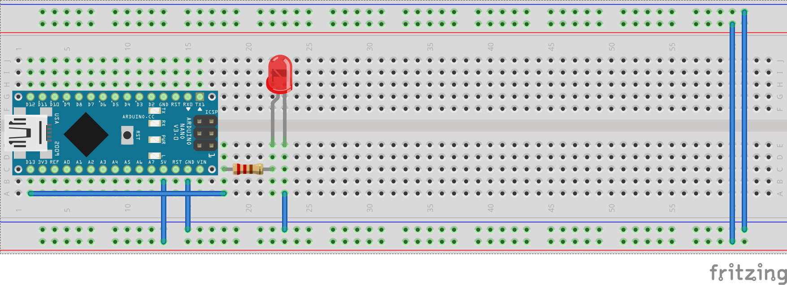
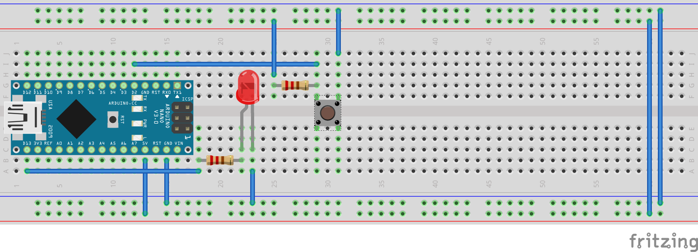
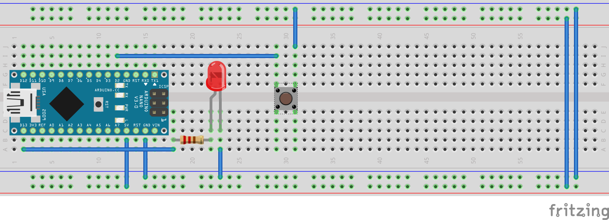

# Formation Arduino

## Spécificités de programmation
Un programme Arduino utilise le langage C/C++.
```c++
// Programme Arduino
void setup {
  // setup() est exécuté une fois au démarrage de l'Arduino.
}

void loop {
  // loop() est exécuté à l'infini après setup()
}

// Équivalent C/C++ standard
void main() {
  setup();
  while(true) {
    loop();
  }
}
```

On n'utilise pas ici `int`, `long`, `short`, `unsigned` car les tailles en mémoire varie selon les systèmes choisis.

On utilise `intX_t`, `uintX_t` (e.g. `int8_t` pour un entier signé sur 8 bits, `uint32_t` pour un entier non signé sur 32 bits).

## Entrées/Sorties numériques (Digital Input/Output)

Les signaux numériques sont des 0 et 1 représentés par GND (0V) et VCC (5V) pour Arduino Uno et Nano.

Les entrées numériques mesurent l'état de la pin.
Les sorties numériques contrôlent l'état de la pin.

On peut choisir le mode entrée ou sortie de la pin avec la fonctions [`pinMode(pin, mode)`](https://www.arduino.cc/reference/en/language/functions/digital-io/pinmode/).
Les deux modes sont :
- `OUTPUT`
- `INPUT`

L'état d'une pin peut être :
- `HIGH`
- `LOW`

On règle l'état d'une pin dans le mode `OUTPUT` avec
[`digitalWrite(pin, value)`](https://www.arduino.cc/reference/en/language/functions/digital-io/digitalwrite/).

On lit l'état d'une pin qui est dans le mode `INPUT` avec
[`digitalRead(pin)`](https://www.arduino.cc/reference/en/language/functions/digital-io/digitalread/) qui retourne l'état commme précédemment.



```c++
const uint8_t LED 13;

void setup() {
  pinMode(LED, OUTPUT);
  digitalWrite(LED, HIGH);
}

void loop() {

}
```


```c++
const uint8_t LED 13;
const uint8_t BUTTON 2;

void setup() {
  pinMode(LED, OUTPUT);
  pinMode(BUTTON, INPUT);
}

void loop() {
  digitalWrite(LED, digitalRead(BUTTON));
}
```


```c++
pinMode(BUTTON, INPUT_PULLUP);
```

## Gestion du temps
Différence entre bloquant et non bloquant
Bloquant
Non bloquant
[`delay(ms)`](https://www.arduino.cc/reference/en/language/functions/time/delay/)
[`millis()`](https://www.arduino.cc/reference/en/language/functions/time/millis/)

## Analogique
Conversion analogique numériques
Lecture
Pas d'écriture analogique mais PWM
[`analogRead(pin)`](https://www.arduino.cc/reference/en/language/functions/analog-io/analogread/)
[`analogWrite(pin, value)`](https://www.arduino.cc/reference/en/language/functions/analog-io/analogwrite/)


## Communication Série
Vitesse de communication
écriture
lecture interprétation (parsing)
[`Serial.begin(speed)`](https://www.arduino.cc/reference/en/language/functions/communication/serial/begin/)
[`Serial.available()`](https://www.arduino.cc/reference/en/language/functions/communication/serial/available/)
[`Serial.print(val)`](https://www.arduino.cc/reference/en/language/functions/communication/serial/print/)
[`Serial.println(val)`](https://www.arduino.cc/reference/en/language/functions/communication/serial/println/)
[`Serial.parseInt()`](https://www.arduino.cc/reference/en/language/functions/communication/serial/parseint/)
[`Serial.parseFloat()`](https://www.arduino.cc/reference/en/language/functions/communication/serial/parsefloat/)
[`Serial.readString()`](https://www.arduino.cc/reference/en/language/functions/communication/serial/readstring/)

## Fonctions diverses
Voici diverses fonctions que Arduino fournit pour divers usages.
Pour générer des nombres aléatoires:
- [`random(min, max)`](https://www.arduino.cc/reference/en/language/functions/random-numbers/random/)
- [`randomSeed(seed)`](https://www.arduino.cc/reference/en/language/functions/random-numbers/randomseed/)

Pour borner une valeur dans un intervalle:
[`constrain(x, a, b)`](https://www.arduino.cc/reference/en/language/functions/math/constrain/)

Pour appliquer une fonction affine sur une valeur sans se tirer les cheveux:
[`map(value, fromLow, fromHigh, toLow, toHigh)`](https://www.arduino.cc/reference/en/language/functions/math/map/)

## Interruption
Qu'est ce que c'est?
Activation/désactivation
[`attachInterrupt(digitalPinToInterrupt(pin), ISR, mode)`](https://www.arduino.cc/reference/en/language/functions/external-interrupts/attachinterrupt/)
[`detachInterrupt(digitalPinToInterrupt(pin))`](https://www.arduino.cc/reference/en/language/functions/external-interrupts/detachinterrupt/)
[`interrupts()`](https://www.arduino.cc/reference/en/language/functions/interrupts/interrupts/)
[`noInterrupts()`](https://www.arduino.cc/reference/en/language/functions/interrupts/nointerrupts/)
